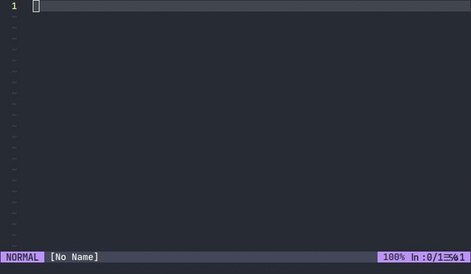

# Auto-correct for Vim / Neovim

 

An auto-correct spelling script for Vim / Neovim using Vim's built-in abbreviations feature.

Type an incorrectly spelled word, hit `SPACE`, the script will automatically correct the word.

## Example of script working in Neovim

## To use the script

- The script must be sourced in your .vimrc for Vim (or init.vim for Neovim)
- Add `source <full PATH to the vim_autocorrect script>`

## Developer(s)

This repository is maintained by:

|  |
| --------------------------------------------------------------------------------------- |
| [RastalDev](https://github.com/rastaldev)                                               |

## License

